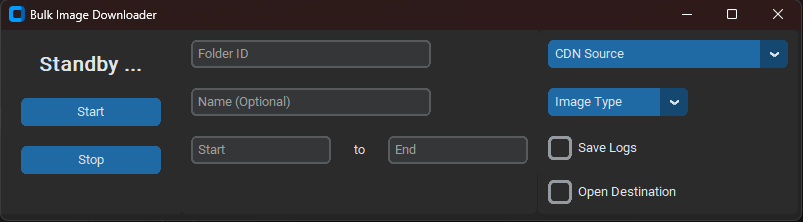

# Bulk Image Scrapper



 The Bulk Image Scrapper application introduces a modern GUI powered by [CustomTkinter](https://github.com/TomSchimansky/CustomTkinter/tree/master), replacing the previous console-only interface. The simple GUI provides an easily accessible interface for scraping image CDNs for personal use. This application was specifically made to handle JPEG, PNG, and GIF image types using a sequential naming scheme. It is compatible with Windows, Mac, and Linux systems.
 
## Usage

1. **Update the CDN Links:**
Open `main.py` and replace the existing links with the CDN servers of your preference.

2. **Launch the Application:**
Execute `python main.py` in your terminal. This command initiates the GUI application.

3. **Input Preferences:**
- Provide the desired server folder name for downloading and specify the picture range.
- Optionally, you can provide a custom folder name for the image destination; otherwise, it will default to the server folder name.
- Choose the preferred CDN and image type. The downloader will attempt to fetch alternative image formats if the primary one is unavailable.

4. **Commence Download:**
Click on the "Start" button to begin the download process. 

Ensure that you have the necessary permissions and dependencies installed to execute the application smoothly.

## Requirements
To get started, ensure you have all the necessary dependencies. You can install them using the following command:
```
pip install -r requirements.txt
```

## Setup Virtual Environment
In the console or terminal, type `python -m venv venv` to initialize the python virtual environment. In linux, you might have to run `sudo apt update && apt update -y` to install pip for later uses.
```
# Windows Users
.\venv\Scripts\activate

# Unix/ Mac Users
source venv/bin/activate

# Exit venv Command
deactivate

```
